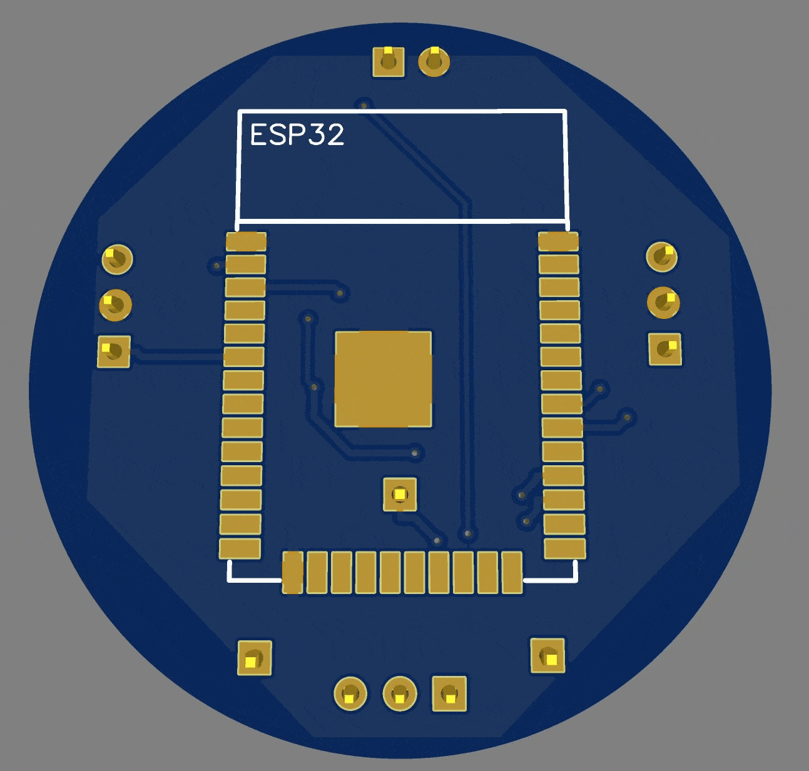
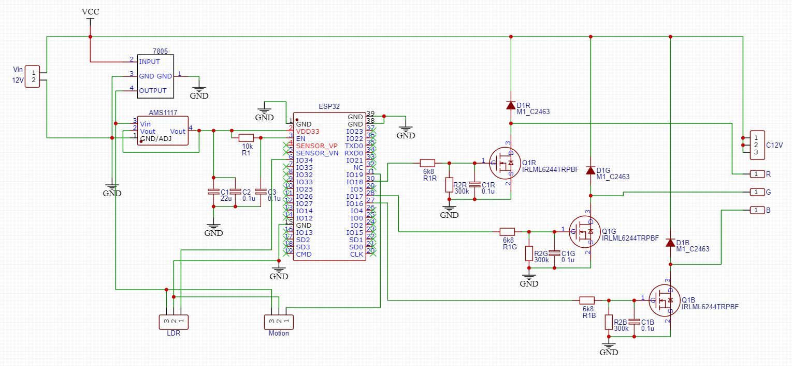
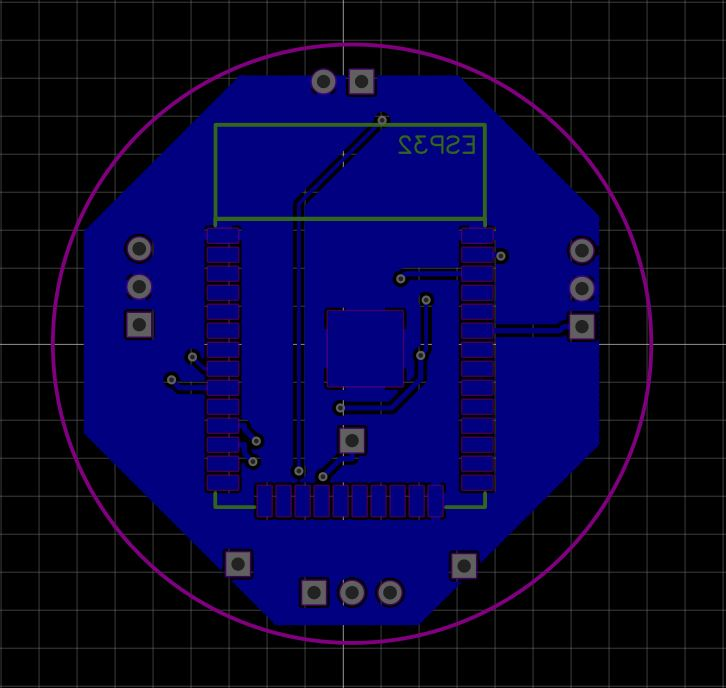
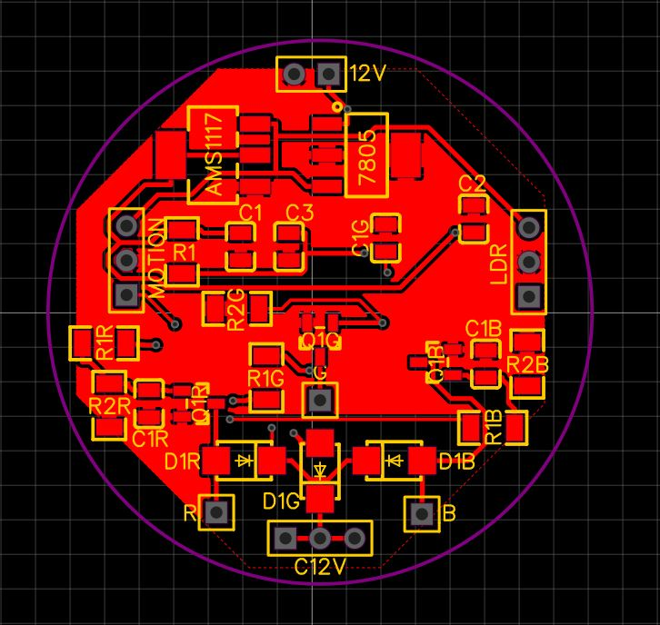
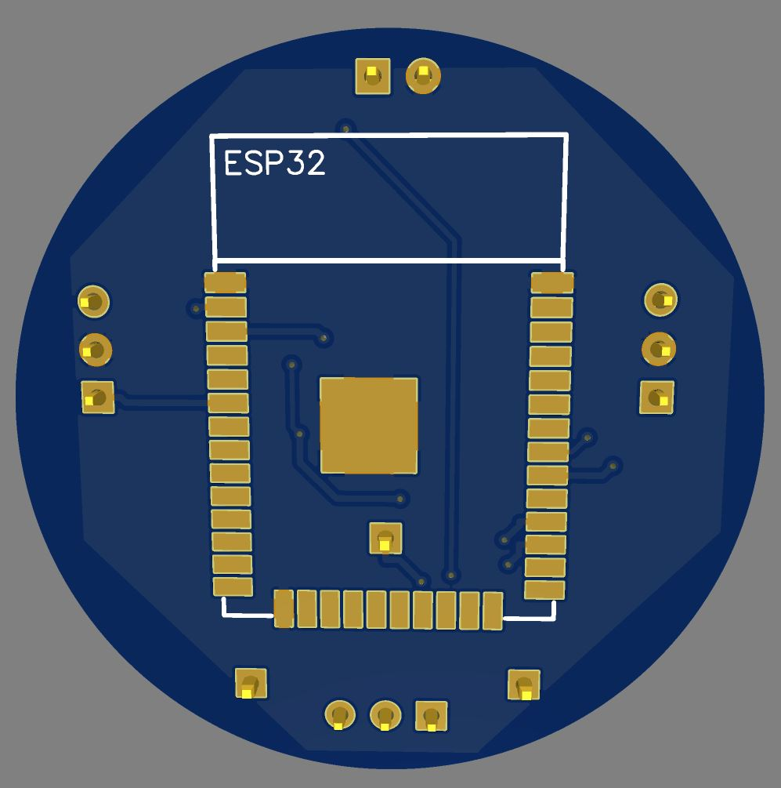
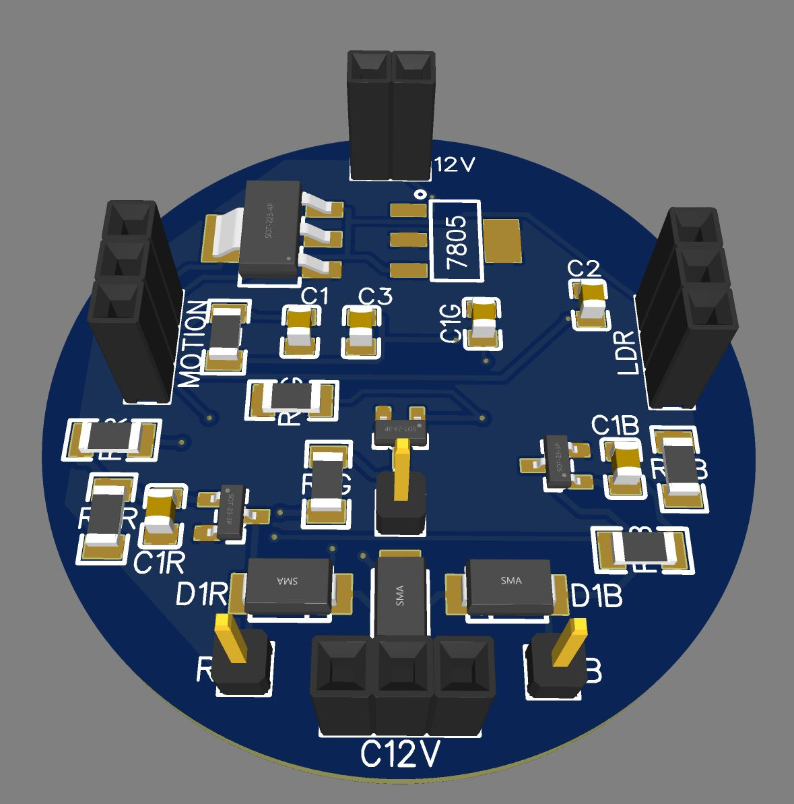

# DTech - Hardware
Steps to build a compact PCB designed for IoT / Home automation applications.  

Here, we must design and build a PCB board capable of controlling an RGB light and some other frills.  
This little board have requiered dimentions to fix inside a led bulb with E27 socket.

### Features PCB
- 2-layer PCB for compact design
- Uses ESP32 microcontroller via WIFI protocol
- 12V Power Supply board
- RGB Light control by MOSFET
- LDR Sensor allow
- PIR Motion Sensor allow

   

  
## Schema
See `SCHEMA/sch_light_rgb.json`

   

Let's split the propposed scheme by parts.  

### 1. Power Supply ⚡
   
   By design, this pcb is expected to work at 12V.
   > 🔍 Why? Current LED bulbs have inside drivers bypassing the internal AC to DC power supply to work

   So, 12V supply may be convenient for:
   
   - Connect our PCB behind driver bulb (Remember, dimension may fix to do that)
   - Use an independent grid generated by renewable energy (*It would be awesome*)

   Okey, our LED must work at 12V... but ESP32 work at 5V - 3.3V. Let's think a strategy 🧠.
   
   Probably, easy way will be using regulator as 7805 to get 5V. *So simple.*  
   Datasheet component have all specs and also have some examples as circuit with capacitor values to improve DC signal. Of course we should take it into account if necessary.
   
   However, we can anticipate an issue...  
   > ⚠️ What? To get low energy compsuption we should supply our HW at 3.3V. Inputs and Output pins of ESP32 work at 3.3V, not 5V, so it's enough!
   
   💡 Again, we found other easy solution: AMS1117 -> 3.3V Regulator. *Surprised? I guess not.*
   
   Using two regulator allow us:  
   - Getting an stable signal
   - Being able to use 5V to supply aditional sensors.

   👀 **Remember we need a small PCB and we are going to use SMD components**
   
### 2. ESP32 Socket & Supply ⚙️

   It's time to take a look at PCB's brain.  
   I've selected ESP-WROOOM-32 because:
   - [x] It's small enough
   - [x] Requieres low consumption
   - [x] It's easy programming with lot of open source libraries (Arduino IDLE)

   You should check your microcontroller (ESP or other) and use easyEDA to find the correct one.  
   In hardware terms, we must be carefull with supply. Here you can read [Hardware Design Guidelines for ESP32](https://docs.espressif.com/projects/esp-hardware-design-guidelines/en/latest/esp32/index.html)
   > When VDD_SDIO is in 3.3 V mode, it is powered by VDD3P3_RTC through an internal resistor of about 6 Ω. Therefore, there will be some voltage drop between VDD_SDIO and VDD3P3_RTC. It is recommended to add a 1 μF filter capacitor close to the VDD_SDIO pin.

   After searching for information from different sources, In schema you will find the solution I decided to implement.  
   Try your own research and tests! 

### 3. MOSFET Control 💡
   Next step will be design a power control stage.  
   I'll choose MOSFET to that porppose to use a simple but effective PWM strategy.
   MOSFET allow us to isolate between ESP32 Outputs (3.3V) and LED power nedeed (12V).  
   Moreover, we can use SMD componets in order to reduce dimensions.
   
### 4. Aditional Sensors 🎯 
   Thinking a little further, there are some aditional functions we have on mind.  
   > We want some data from real world and we need to connect sensors to get that

   Let's prepare the ground for these future situations adding some pins to connect more sensor like:
   - LDR Sensor: Getting current lux will give us the opportunity to decided how many brightness will be neccesary in real time
   - PIR Sensor: In some situations would be interesting use motion to turn on a light in passageways

   We have to route that signals to input pins on ESP32, also supply sensor to 5V typically. 
   Now we have plug & play functions.  
   We can enable and disable that functions via app.  

### 4. Trial & Error 🧩
   Time to test. 
   We can use multiple software tool in order to simulate our schema. It´s much better check by parts instead the all schema.
   Before get all SMD componets, would be easier searching equivalent surface-mounted componets.
   > Use surface-mounted component reduce time and save money!
   We'll use a PCB board to test our prototype.

### 6. Routing and build 🚀
   Last step after check functionality diagram!
   I'll use easyEDA again to route tracks.
   > Here we are another world.. I recomend you research best practise routing in order to get good results.

## Tools Used
- EasyEDA for design
- PCB Board to test
- Oscilloscope
- Multimeter

## Gallery
|                  |                  |
|----------------------------------------------------------|--------------------------------------------------|
|  |  |

## BOM
See `BOM/bom_light_rgb.csv`

## Fabrication
Gerber files are in `fabrication-files/`, ready for production.
