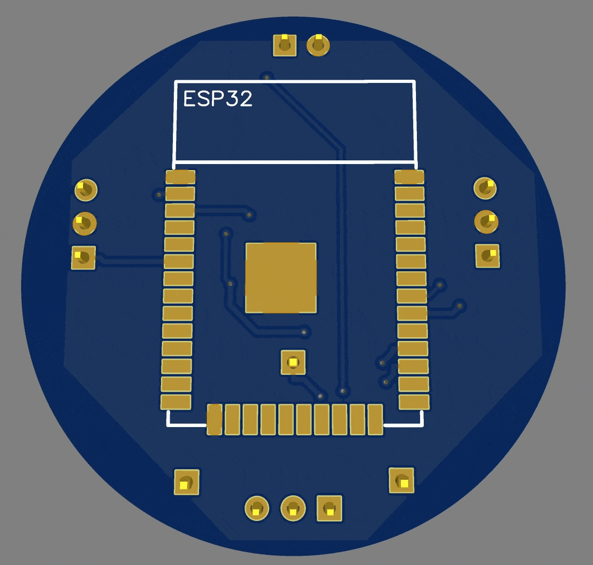
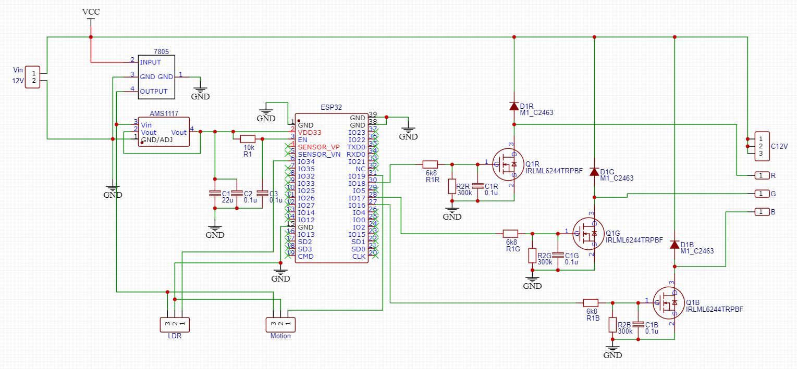
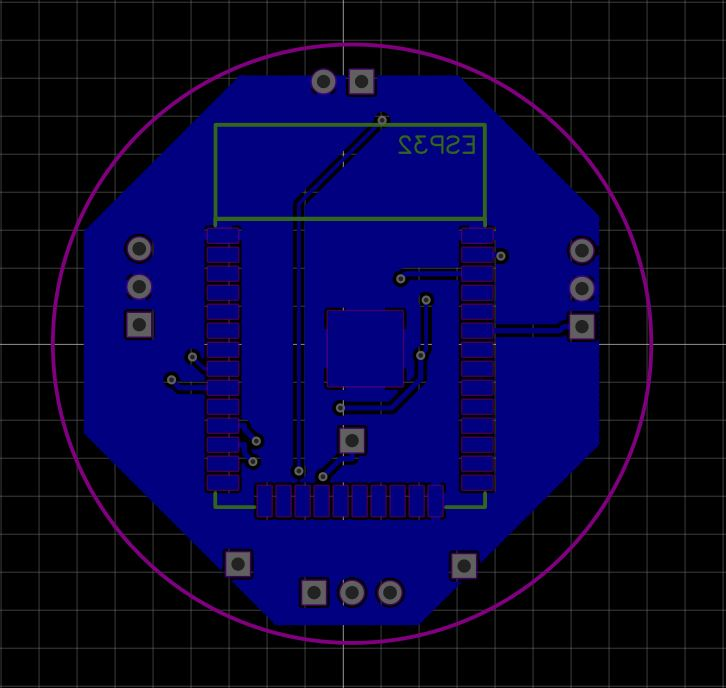
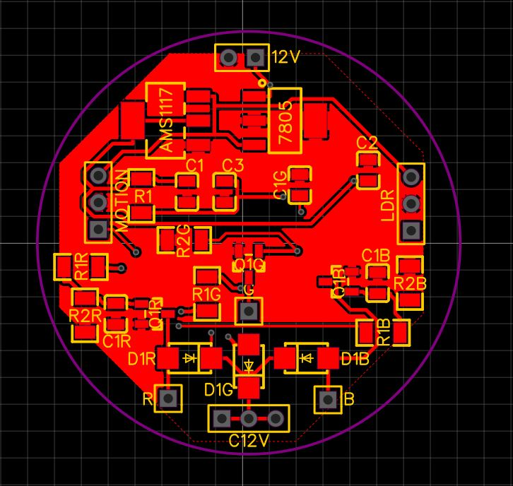
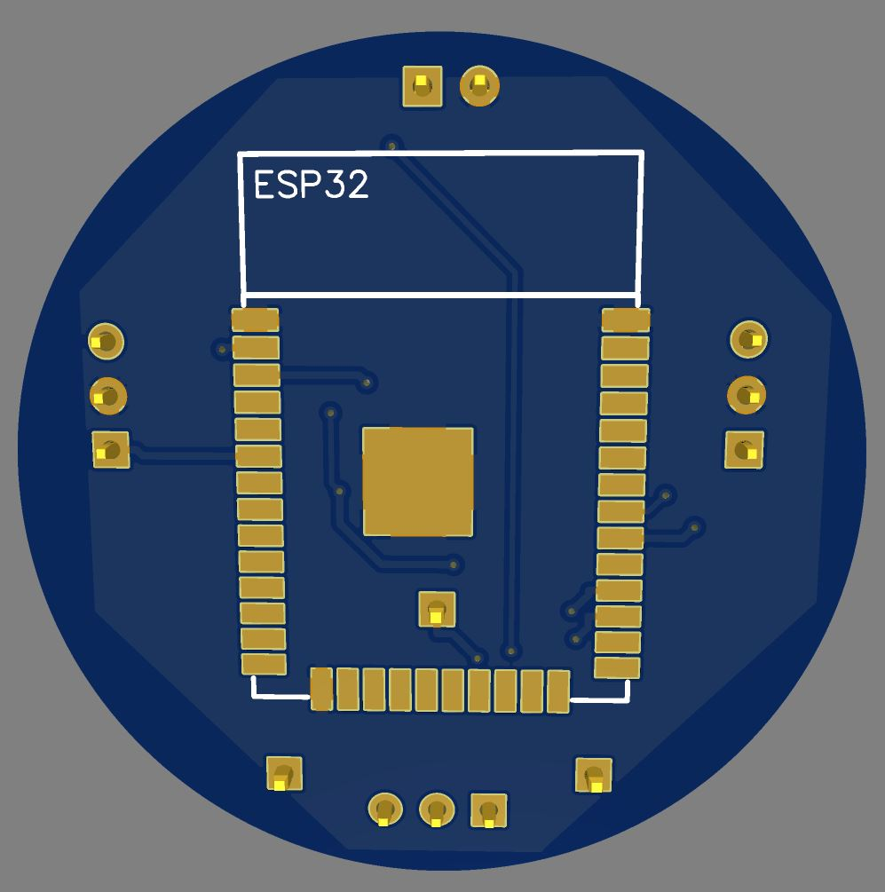
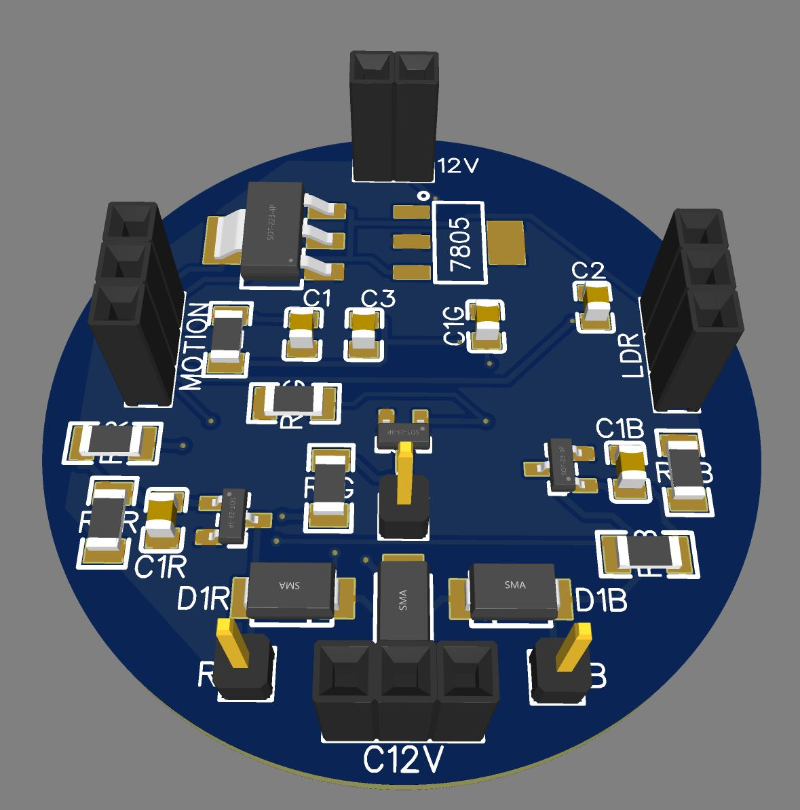

# DTech-Hardware
A compact PCB designed for IoT / Home automation applications

## Scope
This repository belongs to a serie called **DTech** (Domotic Tech) which breaks down a complete home automation project into three stages: Hardware, Microcontroller and App.

The sole objective of this serie is the satisfaction of transforming creative ideas into functional prototypes through problem-solving and self-learning.
> ✨ If you are passionate about this idea like I am, feel free to use this project as a reference to improve it and carry out your own creations!

It's convenience start with **DTech-ESP32** in order to test our PCB with neccesary ~magic~ logic.  
ESP32 microcontroller allow control lights (RGB or not) connecting with MQTT service.

Here, we must design and build a PCB board capable of controlling an RGB light and some other frills.  
This little board have requiered dimentions to fix inside a led bulb with E27 socket.

### Features PCB
- 2-layer PCB for compact design
- Uses ESP32 microcontroller via WIFI protocol
- 12V Power Supply board
- RGB Light control by MOSFET
- LDR Sensor allow
- PIR Motion Sensor allow

   

  
## Schema
See `SCHEMA/sch_light_rgb.json`

   

Let's split the propposed scheme by parts.  

### 1. Power Supply ⚡
   
   By design, this pcb is expected to work at 12V.
   > 🔍 Why? Current LED bulbs have inside drivers bypassing the internal AC to DC power supply to work

   So, 12V supply may be convenient for:
   
   - Connect our PCB behind driver bulb (Remember, dimension may fix to do that)
   - Use an independent grid generated by renewable energy (*It would be awesome*)

   Okey, our LED must work at 12V... but ESP32 work at 5V - 3.3V. Let's think a strategy 🧠.
   
   Probably, easy way will be using regulator as 7805 to get 5V. *So simple.*  
   Datasheet component have all specs and also have some examples as circuit with capacitor values to improve DC signal. Of course we should take it into account if necessary.
   
   However, we can anticipate an issue...  
   > ⚠️ What? Inputs and Output pins of ESP32 work at 3.3V, not 5V!
   
   💡 Again, we found other easy solution: AMS1117 -> 3.3V Regulator. *Surprised? I guess not.*
   
   Using two regulator allow us:  
   - Getting an stable signal
   - Being able to use 5V to supply aditional sensors.

   👀 **Remember we need a small PCB and we are going to use SMD components**
   
### 2. ESP32 Socket & Supply ⚙️

   It's time to take a look at PCB's brain.  
   I've selected ESP-WROOOM-32 because:
   - [x] It's small enough
   - [x] Requieres low consumption
   - [x] It's easy programming with lot of open source libraries (Arduino IDLE)

   You should check your microcontroller (ESP or other) and use easyEDA to find the correct one.  
   In hardware terms, we must be carefull with supply. Here you can read [Hardware Design Guidelines for ESP32](https://docs.espressif.com/projects/esp-hardware-design-guidelines/en/latest/esp32/index.html)
   > When VDD_SDIO is in 3.3 V mode, it is powered by VDD3P3_RTC through an internal resistor of about 6 Ω. Therefore, there will be some voltage drop between VDD_SDIO and VDD3P3_RTC. It is recommended to add a 1 μF filter capacitor close to the VDD_SDIO pin.

   After searching for information from different sources, In schema you will find the solution I decided to implement.  
   Try your own research and tests! 

### 3. MOSFET Control 💡

### 4. Aditional Sensors 🎯 

### 4. Routing 🧩

## Tools Used
- EasyEDA for design
- PCB Board to test
- Oscilloscope
- Multimeter

## Gallery
|                  |                  |
|----------------------------------------------------------|--------------------------------------------------|
|  |  |

## BOM
See `BOM/bom_light_rgb.csv`

## Fabrication
Gerber files are in `fabrication-files/`, ready for production.
